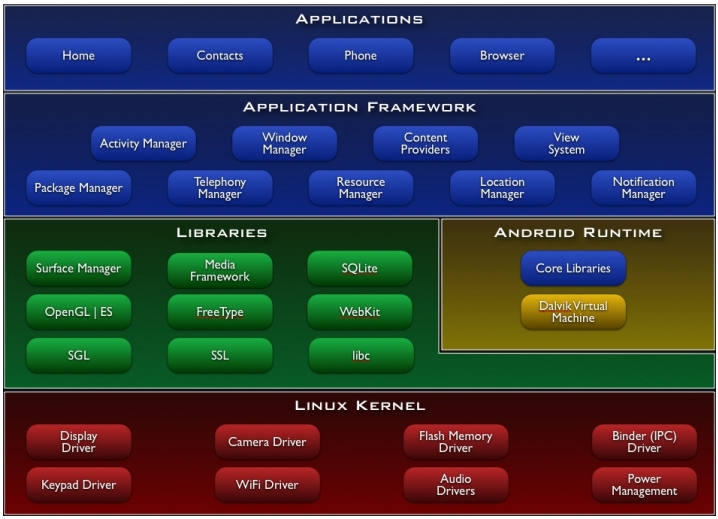
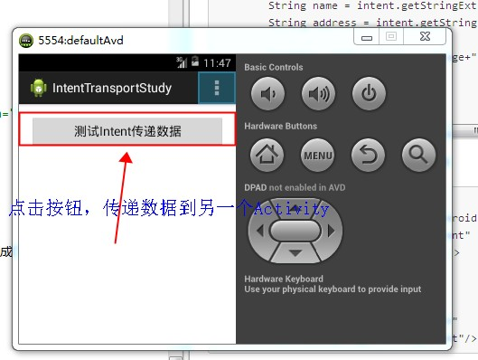
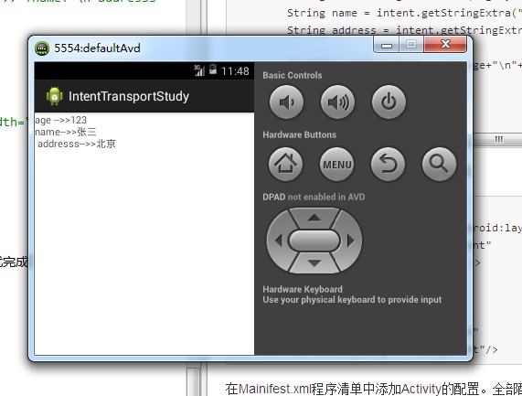

## 一、基础知识
1. Android SDK/NDK：Android SDK包含了一个调试器、库、一个模拟器、文档、实例代码和教程。NDK 是支持native app 开发所需的一套支持，即使用c/c++ 开发。  
2. ADT: 用于Eclipse的Android开发工具（Android Development Tools，ADT）插件是对Eclipse IDE的扩展，用以支持android应用程序的创建和调试。
3. AVD(Android Virtual Device): AVD是一个模拟器实例，可以用来模拟一个真实的设备。
4. Activity: Activity(活动）是一个包含应用程序的用户界面窗口，一个应用程序可以有零个或多个活动。Activity 是所有程序的根本，所有程序都运行在Activity之中，Activity具有自己的生命周期，由系统控制生命周期，程序无法改变。
5. Intent：Intent是android中的一种消息通信机制（媒介），专门提供组件互相调用的相关信息，实现调用者和被调用的解耦。
* 显式Intent：指定了component属性的intent（调用 setComponent）或者setClass（context，class）来指定）。通过指定具体的组件类，调用应用启动对应的组件。
* 隐式Intent：没有指定component属性的Intent。这些Intent需要包含足够的信息，这些系统才能根据这些信息，在所有的可用组件中，确定满足此Intent的组件。

6. Toast: Toast是android中用来显示信息的一种机制，和Dialog不一样的是Toast是没有焦点的，而且Toast显示的时间有限，过一定时间就会自动消失。
7. Android 操作系统： Android是一种基于Linux的开源的收集操作系统。
8. APK是Android Package的缩写，即Android安装包（anapk）。
APK文件其实是zip格式，但后缀名修改为APK，通过UnZip解压后，可以看到Dex文件，Dex是Dalvik VM executes的全称，即Android Dalvik执行程序，并非Java的字节码而是Dalvik的字节码。但如AndroidManifest.xml 等文件是查看不到原有内容的，需要用apktool 等工具反编译。
9. Android 四大组件（Activity，Service，Broadcast Receiver,Content Provider）
* Activity:应用程序中，一个Activity通常是一个单独的屏幕，它上面可以显示一些控件也可以监听并处理用户的事件做出响应。Activity之间通过Intent进行通信，在Intent的描述结构中，有两个重要的部分：动作和动作对应的数据。
* Broadcast Receiver:广播接收者（BroadcastReceiver）用于接收广播Intent，广播Intent的发送是通过调用Context.sendBroadCast()、Context.sendOrderedBroadcast()、Context.sendStickyBroadcast() 来实现的，BroadcastReceiver 广泛应用于应用间的交流。  
通常一个广播Intent可以被订阅了此Intent的多个广播接收者所接收（就像真的收音机一样）。  
广播（Broadcas）是一种广泛运用的应用程序之间的传输消息的机制。
而广播接收者（BroadcastReceiver）是对发送出来的广播进行过滤并接收响应的一类组件。  
* BroadcastReceiver生命周期：每次广播到来时，会重新创建BroadcastReceiver对象，并调用onReceive()方法，执行完以后，该对象即被销毁。当onReceive()方法在10s内没有执行完毕，就会导致ANR。如果需要执行长任务，那么就必须要使用Service。另外在onReceive中使用线程是很危险的事情。因为线程没有执行完，BroadcastReceiver就挂了。  
注：ANR（Application No Response）：程序无响应的错误信息。  
* Service：和Activity属于同一级别的组件，不能自己运行只能后台运行，并且可以和其他组件进行交互。Service可以在很多场合的应用中使用，比如播放多媒体的时候启动了其他Activity，这个时候程序要在后台继续播放。  
一个Service是一段长生命周期的，没有用户界面的程序，可以用来开发如监控类程序。  
* Content Provider：ContentProvider在android中的作用是对外共享数据，也就是说你可以通过ContentProvider把应用中的数据共享给其他应用访问，其他应用可以通过ContentProvider对你应用的数据进行增删改查。
关于共享数据，可以使用文件操作模式，通过指定文件的操作模式为Context.MODEWORLDREADABLE 或 Context.MODEWORLDWRITEABLE同样也可以对外共享数据，但是使用文件共享数据存在数据访问方式不统一的问题。而Content Provider则对外暴露了统一的接口，每个应用程序都可以通过统一的接口操作数据。  
10. 常用的布局管理器：  
布局管理器一般有四种：  
LinearLayout:线性布局管理器（默认），分为水平（horizontal）和垂直（vertical）两种，只能进行单行布局。  
FrameLayout:所有组件放在左上角，一个覆盖一个。  
TableLayout:任意行和列的表格布局管理器，其中TableRow代表一行，可以向行中增加组件。  
RelativeLayout：相对布局管理器，根据最近一个组件或者顶层父组件来确定下一个组件的位置。  
11. Android应用程序是用Java语言写的，通过aapt工具把编译好的java代码和应用程序所需要的所有数据、资源文件打包成Android包，及后缀为.apk的压缩文件，这个文件时发布应用程序和在移动设备上安装应用程序的媒介，是用户下载到他们设备上的文件。一个.apk文件中的所有代码属于一个应用程序。
11. Android体系结构：  
官网体系结构图：  
  
Android从上到下分为4层：Android应用层，Android应用框架层，Android系统运行层，Linux内核层。  

12. 每一个Android应用程序都在自己的进程中运行，都拥有一个独立的Dalvik虚拟机实例。Dalvik被设计成一个设备可以同时高效的运行多个虚拟系统。Dalvik虚拟机执行（.dex）的Dalvik可执行文件，该格式文件针对小内存使用做了优化。同时虚拟机是基于寄存器的，所有的类都经由Java编译器编译，然后.class通过SDK中的"dx"工具转化成.dex格式由虚拟机执行。  

13. Android Activity 生命周期：  
生命周期图：  
  

Resumed状态:  
在这种状态下，该Activity在前台运行，用户可以与它进行交互。（有时也简称为"running"状态。）  
Paused状态:  
在这种状态下，该Activity被部分遮蔽（被其他在前台的半透明或不覆盖整个屏幕的活动遮住）。此状态不接受用户输入，并且不能执行任何代码。  
Stopped状态:  
在这种状态下，该活动是完全隐藏，不可见的，可视为存在于后台。虽然停止，活动实例和所有成员变量如状态信息将被保留，但不能执行任何代码。  
(1)当程序第一次运行时用户会看到主Activity，主Activity可以通过启动其他的Activity进行相关操作。  
(2)当启动其他的Activity时当前的Activity将会停止，新的Activity将会压入栈中，同时获取用户焦点，这时就可在这个Activity上操作了。        
(3)根据栈的先进后出原则，当用户按Back键时，当前这个Activity销毁，前一个Activity重新恢复。  
15. Activity 之间传递数据的几种方式：  
(1) 将数据封装在Intent变量中。（使用Intent传递对象有一个局限性，就是不能传递不能序列化的对象）  
(2) 使用系统的剪切板来传递数据。  
获取剪切板的代码如下：    
`ClipboardManager clipboardManager = (ClipboardManager) getSystemService(Context.CLIPBOARD_SERVICE);  `
(3) 使用全局变量来传递数据:  
例如：  
//myApp是一个应用级别的全局对象，在应用的任何地方都可以调用这个对象。   
`MyApp myApp = (MyApp)getApplication();`  
(4) 使用静态变量传递数据:可以在目标的 Activity 中，声明公开的静态属性，在调用的Activity针对这个属性进行赋值，来进行数据的传递。    
16. 从Activity中返回数据：  
(1) startActivity():用于启动意图。  
(2) startActivityForResult():启动意图并获取返回结果。在等待返回结果的Activity中必须实现onActivityResult方法。  　 　  
17. finish方法用来结束Activity的生命周期。　 　  

## 二、实现DEMO
1.利用Intent在两个Activity之间传递数据:  
关键代码 在源码包添加调用者和被调用者的 Activity java类：  

调用者 Main.java：  
``` java
@Override
public class Main extends Activity {

    private Button button;
    @Override
    protected void onCreate(Bundle savedInstanceState) {
        super.onCreate(savedInstanceState);
        //加载布局文件
        setContentView(R.layout.main);
        button = (Button)this.findViewById(R.id.button);
        button.setOnClickListener(new View.OnClickListener() {

            @Override
            public void onClick(View v) {
                Intent intent = new Intent(Main.this,OtherActivity.class);
                //在意图中传递数据
                intent.putExtra("name", "张三");
                intent.putExtra("age", 123);
                intent.putExtra("address", "北京");
                //启动意图
                startActivity(intent);
            }
        });
    }

    @Override
    public boolean onCreateOptionsMenu(Menu menu) {
        // Inflate the menu; this adds items to the action bar if it is present.
        getMenuInflater().inflate(R.menu.main, menu);
        return true;
    }
}
```
被调用者 OtherActivity.java：  
``` java
public class OtherActivity extends Activity {

    private TextView textView;

    public OtherActivity() {

    }

    @Override
    protected void onCreate(Bundle savedInstanceState) {
        // TODO Auto-generated method stub
        super.onCreate(savedInstanceState);
        setContentView(R.layout.other);
        textView = (TextView)this.findViewById(R.id.msg);
        Intent intent = getIntent();
        int age = intent.getIntExtra("age", 0);
        String name = intent.getStringExtra("name");
        String address = intent.getStringExtra("address");

        textView.setText("age -->>"+age+"\n"+"name-->>"+name+"\n addresss-->>"+address);

    }
}
```
在res的layout目录下配置两个布局配置文件:  

主Activity的配置文件 main.xml 中添加：  
``` xml
 <Button android:id="@+id/button" android:layout_width="match_parent"
    android:layout_height="wrap_content"
    android:text="测试Intent传递数据" />
```
被调用的Activity中添加：  
``` xml
<TextView android:id="@+id/msg"
    android:layout_width="fill_parent"
    android:layout_height="fill_parent"/>
```
在Manifest.xml程序清单中添加Activity的配置。  
全部配置完毕后就完成了一个Activity通过Intent传递信息到另一个Activity的过程。     
调用者：    
  
被调用者：  
  
### android:id

这是视图的唯一标识符。可以在程序代码中通过该标识符引用对象，例如对这个对象进行读和修改的操作。  
当需要从 XML 里引用资源对象时，必须使用 @ 符号。紧随 @ 之后的是资源的类型（这里是 id），然后是资源的名字（这里使用的是 button/msg）。+ 号只在第一次定义一个资源 ID 的时候需要，它是告诉 SDK——此资源 ID 需要被创建。在应用程序被编译之后，SDK 就可以直接使用这个 ID。

## Reference
http://blog.csdn.net/lantian0802/article/details/21811545